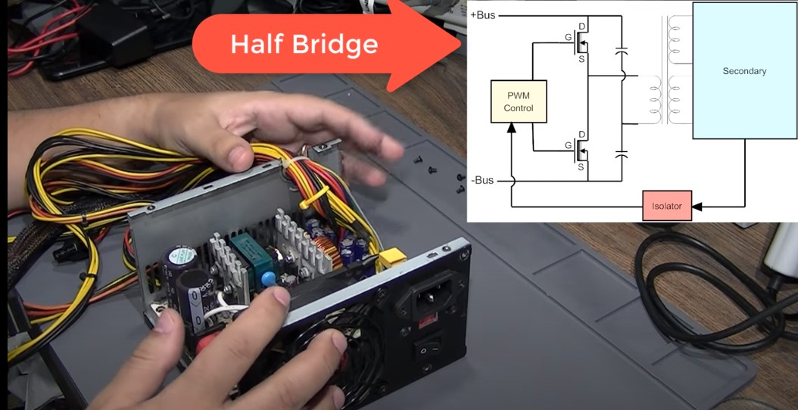

# Fonte_Chaveada

```CMD
https://en.wikipedia.org/wiki/Switched-mode_power_supply
SMPS - switched-mode power supply, switching-mode power supply, switch-mode power supply, switched power supply.
```


## Tipos_De_Fontes



### Topologia_Nao_Isolada

```CMD

```

### Topologia_Isolada

```CMD


```
