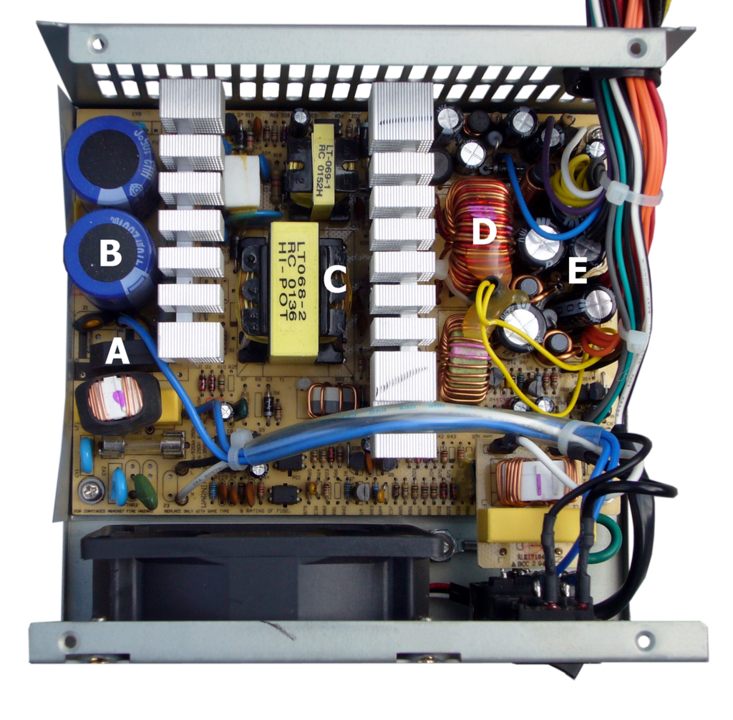
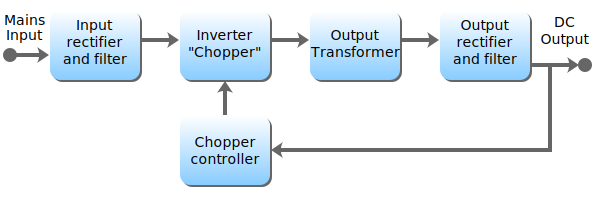

# Teoria



```CMD
A: Bridge rectifier;
B: input filter capacitors;
Between B and C: heat sink for switching active components of primary voltage;
C: transformer:
Between C and D: heat sink for switching active components of at least five secondary voltages, per the ATX specification;
D:  output filter coil for the secondary with the largest power rating. In close proximity, filter coils for the other secondaries;
E: output filter capacitors.  
The coil and large rectangular yellow capacitor below the bridge rectifier form an EMI filter and are not part of the main circuit board.

```

## Blocos



### Input_Rectifier_Stage


```CMD
If the SMPS has an AC input, then the first stage is to convert the input to DC. This is called 'rectification'. An SMPS with a DC input does not require this stage. In some power supplies (mostly computer ATX power supplies), the rectifier circuit can be configured as a voltage doubler by the addition of a switch operated either manually or automatically. This feature permits operation from power sources that are normally at 115 VAC or at 230 VAC. The rectifier produces an unregulated DC voltage which is then sent to a large filter capacitor. The current drawn from the mains supply by this rectifier circuit occurs in short pulses around the AC voltage peaks. These pulses have significant high frequency energy which reduces the power factor. To correct for this, many newer SMPS will use a special power factor correction (PFC) circuit to make the input current follow the sinusoidal shape of the AC input voltage, correcting the power factor. Power supplies that use active PFC usually are auto-ranging, supporting input voltages from ~100 VAC – 250 VAC, with no input voltage selector switch.

An SMPS designed for AC input can usually be run from a DC supply, because the DC would pass through the rectifier unchanged.[37] If the power supply is designed for 115 VAC and has no voltage selector switch, the required DC voltage would be 163 VDC (115 × √2). This type of use may be harmful to the rectifier stage, however, as it will only use half of diodes in the rectifier for the full load. This could possibly result in overheating of these components, causing them to fail prematurely. On the other hand, if the power supply has a voltage selector switch, based on the Delon circuit, for 115/230 V (computer ATX power supplies typically are in this category), the selector switch would have to be put in the 230 V position, and the required voltage would be 325 VDC (230 × √2). The diodes in this type of power supply will handle the DC current just fine because they are rated to handle double the nominal input current when operated in the 115 V mode, due to the operation of the voltage doubler. This is because the doubler, when in operation, uses only half of the bridge rectifier and runs twice as much current through it.
```

### Inverter_Stage

```CMD
This section refers to the block marked chopper in the diagram.
The inverter stage converts DC, whether directly from the input or from the rectifier stage described above, to AC by running it through a power oscillator, whose output transformer is very small with few windings, at a frequency of tens or hundreds of kilohertz. The frequency is usually chosen to be above 20 kHz, to make it inaudible to humans. The switching is implemented as a multistage (to achieve high gain) MOSFET amplifier. MOSFETs are a type of transistor with a low on-resistance and a high current-handling capacity.
```

### Voltage_Converter_and_Output_Rectifier

```CMD
If the output is required to be isolated from the input, as is usually the case in mains power supplies, the inverted AC is used to drive the primary winding of a high-frequency transformer. This converts the voltage up or down to the required output level on its secondary winding. The output transformer in the block diagram serves this purpose.

If a DC output is required, the AC output from the transformer is rectified. For output voltages above ten volts or so, ordinary silicon diodes are commonly used. For lower voltages, Schottky diodes are commonly used as the rectifier elements; they have the advantages of faster recovery times than silicon diodes (allowing low-loss operation at higher frequencies) and a lower voltage drop when conducting. For even lower output voltages, MOSFETs may be used as synchronous rectifiers; compared to Schottky diodes, these have even lower conducting state voltage drops.

The rectified output is then smoothed by a filter consisting of inductors and capacitors. For higher switching frequencies, components with lower capacitance and inductance are needed.

Simpler, non-isolated power supplies contain an inductor instead of a transformer. This type includes boost converters, buck converters, and the buck–boost converters. These belong to the simplest class of single input, single output converters which use one inductor and one active switch. The buck converter reduces the input voltage in direct proportion to the ratio of conductive time to the total switching period, called the duty cycle. For example, an ideal buck converter with a 10 V input operating at a 50% duty cycle will produce an average output voltage of 5 V. A feedback control loop is employed to regulate the output voltage by varying the duty cycle to compensate for variations in input voltage. The output voltage of a boost converter is always greater than the input voltage and the buck–boost output voltage is inverted but can be greater than, equal to, or less than the magnitude of its input voltage. There are many variations and extensions to this class of converters but these three form the basis of almost all isolated and non-isolated DC-to-DC converters. By adding a second inductor the Ćuk and SEPIC converters can be implemented, or, by adding additional active switches, various bridge converters can be realized.

Other types of SMPSs use a capacitor–diode voltage multiplier instead of inductors and transformers. These are mostly used for generating high voltages at low currents (Cockcroft-Walton generator). The low voltage variant is called charge pump.

```

### Regulation

```CMD
A feedback circuit monitors the output voltage and compares it with a reference voltage. Depending on design and safety requirements, the controller may contain an isolation mechanism (such as an opto-coupler) to isolate it from the DC output. Switching supplies in computers, TVs and VCRs have these opto-couplers to tightly control the output voltage.

Open-loop regulators do not have a feedback circuit. Instead, they rely on feeding a constant voltage to the input of the transformer or inductor, and assume that the output will be correct. Regulated designs compensate for the impedance of the transformer or coil. Monopolar designs also compensate for the magnetic hysteresis of the core.

The feedback circuit needs power to run before it can generate power, so an additional non-switching power supply for stand-by is added.
```
